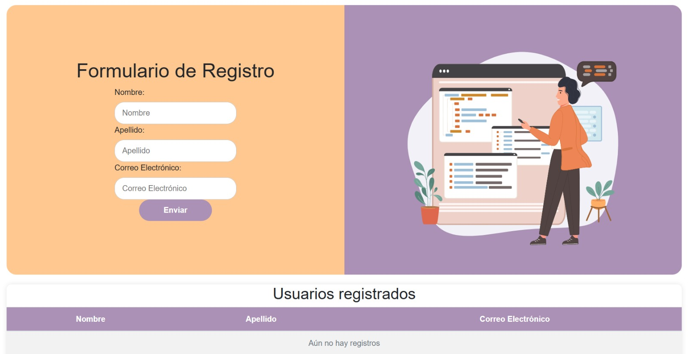

# BIENVENIDO/A A NUESTRO PROYECTO | SOFTPARTY 2025 
## SOMOS **INGENIUM**, Y VENIMOS DESDE EL RETIRO 

Nuestro equipo esta conformado por 4 integrantes, todos estudiantes del grado decimo de la **Institución Educativa Ignacio Botero Vallejo** y de la tecnica en **Programación de Software del SENA**:

- **Lizeth Carmona Dávila** - [GitHub](https://github.com/lzth2210)
- **Juan Andres Marulanda Ramirez** 
- **Santiago Acevedo Villa**
- **Maria Paulina Arenas Orozco**

## SOBRE EL PROYECTO:

- **Descripción:** Nuestro proyecto se basa en la corrección de errores en el código fuente que se nos fue dado, además de la implementación de las características pedidas en el reto.

## Tecnologías Utilizadas:

1. HTML5
2. CSS3
3. JavaScript Vanilla
4. Bootstrap 5
5. Git y GitHub Pages
6. SweetAlert2

## Estructura del Proyecto:

```python
/SOFTPARTY-2025
  ├─ /docs
  │   ├─ /assets
  │   │   ├─ /css
  │   │   │   ├─ /bootstrap
  │   │   │   │   ├─ bootstrap.min.css
  │   │   │   │   └─ bootstrap.bundle.min.js
  │   │   │   └─ styles.css
  │   │   ├─ /img
  │   │   └─ /js
  └─ README.md
```
## Cómo usar este repositorio:

1. Clona este repositorio en tu máquina local usando:
   ```
   git clone https://github.com/lzth2210/INGENIUM-Softparty.git
   ```
2. Navega al directorio del proyecto:
   ```
   cd SOFTPARTY-2025
   ```
3. Abre el archivo `formulario.html` en tu navegador web para ver la página. 
4. Si deseas hacer cambios, edita los archivos CSS o JavaScript en la carpeta `assets`.

## Imagen del Proyecto:

 

## Agradecimientos:

Agradecemos a nuestra institución y a nuestro instructor SENA por brindarnos el apoyo y las herramientas necesarias para este proyecto.